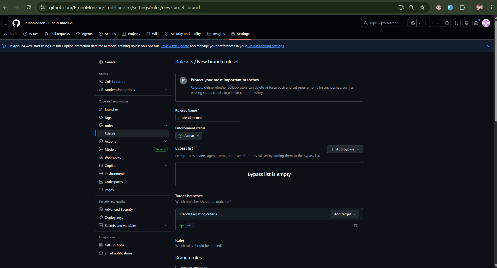
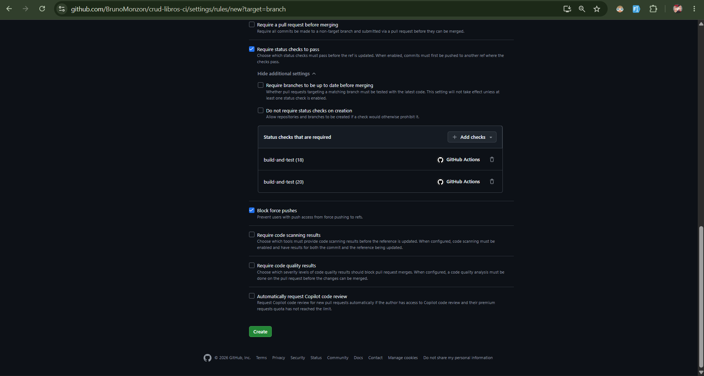
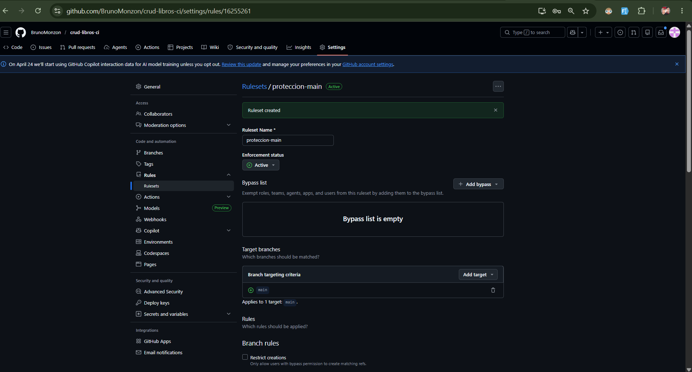
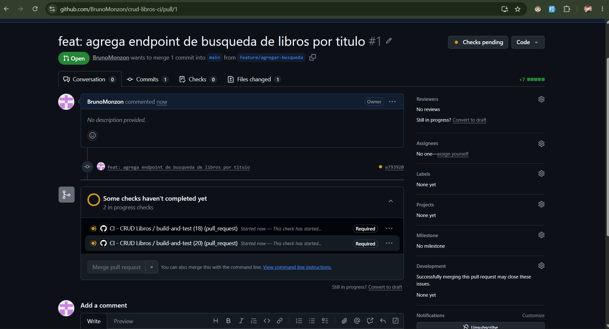
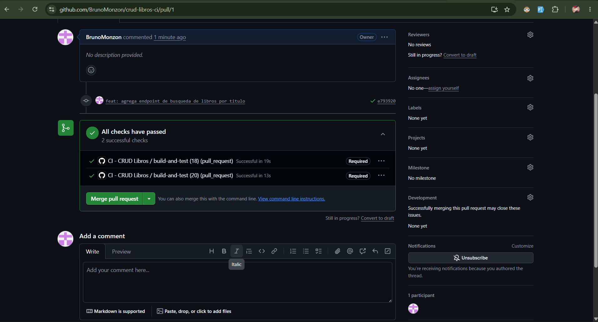
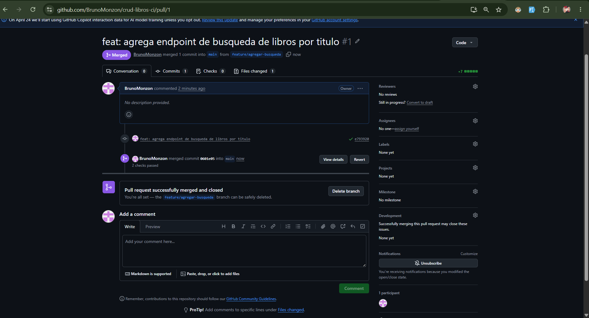
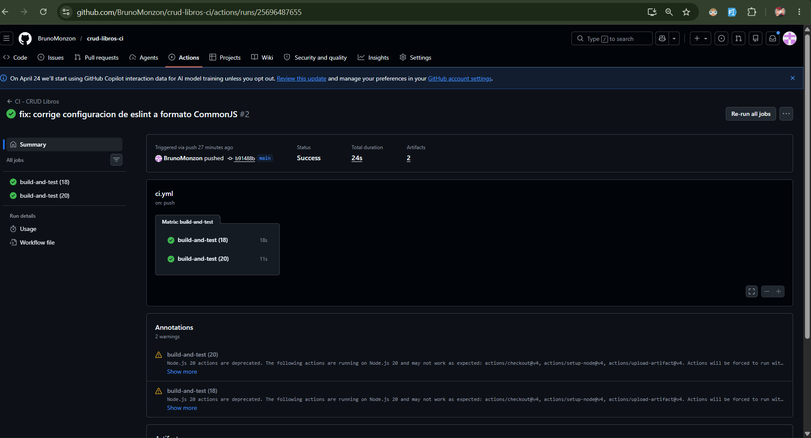
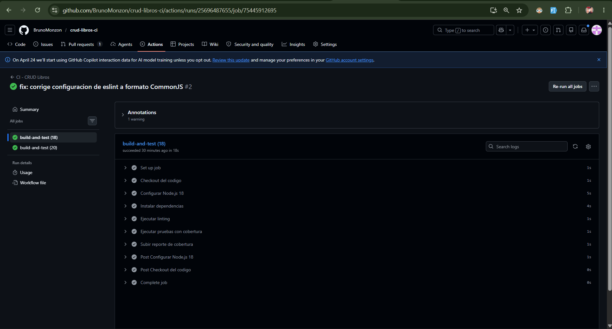
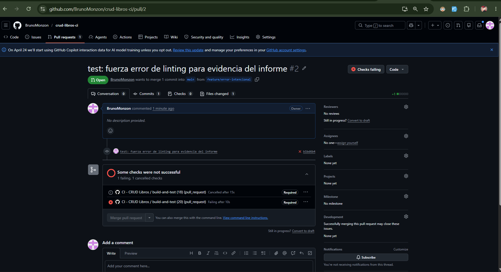

# Informe de Práctica Individual
## Laboratorio 5.1 — GitHub Actions CI

---

| Campo | Detalle |
|---|---|
| **Materia** | COM610 |
| **Estudiante** | Monzon Bruno Antonio |
| **Carnet Universitario** | 111-421 |
| **Laboratorio** | 5.1 — Práctica Individual |
| **Repositorio** | https://github.com/BrunoMonzon/crud-libros-ci |
| **Fecha** | 11 de mayo de 2026 |

---

## 1. Descripción del Proyecto

Se desarrolló una API REST con **Express (Node.js)** que implementa operaciones CRUD completas sobre la entidad **Libro**. Cada libro tiene los campos: `id`, `titulo`, `autor` y `anio`. Los datos se almacenan en memoria durante la ejecución del servidor.

La aplicación incluye 8 pruebas de integración escritas con **Jest** y **Supertest**, cubriendo todos los endpoints de la API. Se configuró un pipeline de CI con **GitHub Actions** que ejecuta linting, pruebas y genera un reporte de cobertura automáticamente en cada `push` y `pull_request`.

### Endpoints disponibles

| Método | Ruta | Descripción |
|---|---|---|
| GET | `/libros` | Obtiene todos los libros |
| GET | `/libros/:id` | Obtiene un libro por ID |
| POST | `/libros` | Crea un nuevo libro |
| PUT | `/libros/:id` | Actualiza un libro existente |
| DELETE | `/libros/:id` | Elimina un libro |
| GET | `/libros/buscar/:titulo` | Busca libros por título |

---

## 2. Estructura del Proyecto

```
crud-libros-ci/
├── .github/
│   └── workflows/
│       └── ci.yml
├── app.js
├── app.test.js
├── libros.js
├── server.js
├── eslint.config.cjs
├── package.json
└── .gitignore
```

---

## 3. Configuración del Pipeline CI

El pipeline de CI se configuró en `.github/workflows/ci.yml` e incluye los siguientes pasos:

- **Checkout** del código fuente
- **Setup** del entorno Node.js (versiones 18 y 20 en paralelo)
- **Instalación** de dependencias con `npm ci`
- **Linting** con ESLint
- **Ejecución de pruebas** con Jest
- **Generación de reporte de cobertura** con `jest --coverage`
- **Subida del reporte** como artefacto en GitHub Actions

### Contenido de `.github/workflows/ci.yml`

```yaml
name: CI - CRUD Libros

on:
  push:
    branches: [main]
  pull_request:
    branches: [main]

jobs:
  build-and-test:
    runs-on: ubuntu-latest

    strategy:
      matrix:
        node-version: [18, 20]

    steps:
      - name: Checkout del codigo
        uses: actions/checkout@v4

      - name: Configurar Node.js ${{ matrix.node-version }}
        uses: actions/setup-node@v4
        with:
          node-version: ${{ matrix.node-version }}

      - name: Instalar dependencias
        run: npm ci

      - name: Ejecutar linting
        run: npm run lint

      - name: Ejecutar pruebas con cobertura
        run: npm test

      - name: Subir reporte de cobertura
        uses: actions/upload-artifact@v4
        with:
          name: coverage-report-node${{ matrix.node-version }}
          path: coverage/
```

---

## 4. Comandos Utilizados

### Inicialización del proyecto

```bash
# Clonar el repositorio
git clone https://github.com/BrunoMonzon/crud-libros-ci.git
cd crud-libros-ci

# Inicializar proyecto Node.js
npm init -y

# Instalar dependencias de producción
npm install express

# Instalar dependencias de desarrollo
npm install --save-dev jest supertest eslint @eslint/js globals
```

### Crear archivos del proyecto

```powershell
New-Item -ItemType File -Path libros.js
New-Item -ItemType File -Path app.js
New-Item -ItemType File -Path server.js
New-Item -ItemType File -Path app.test.js
New-Item -ItemType File -Path eslint.config.cjs
New-Item -ItemType File -Path .gitignore
```

### Crear el workflow de CI

```powershell
New-Item -ItemType Directory -Force -Path .github\workflows
New-Item -ItemType File -Path .github\workflows\ci.yml
```

### Ejecución local de pruebas

```bash
npm test
```

Resultado obtenido:

```
PASS  ./app.test.js
  CRUD Libros
    √ GET /libros debe retornar lista de libros (37 ms)
    √ GET /libros/:id debe retornar un libro existente (6 ms)
    √ GET /libros/:id debe retornar 404 si no existe (5 ms)
    √ POST /libros debe crear un nuevo libro (18 ms)
    √ POST /libros debe retornar 400 si faltan campos (4 ms)
    √ PUT /libros/:id debe actualizar un libro (7 ms)
    √ DELETE /libros/:id debe eliminar un libro (5 ms)
    √ DELETE /libros/:id debe retornar 404 si no existe (5 ms)

-----------|---------|----------|---------|---------|
File       | % Stmts | % Branch | % Funcs | % Lines |
-----------|---------|----------|---------|---------|
All files  |   96.49 |    86.66 |     100 |     100 |
 app.js    |   96.55 |     90.9 |     100 |     100 |
 libros.js |   96.42 |       75 |     100 |     100 |
-----------|---------|----------|---------|---------|

Tests: 8 passed, 8 total
```

### Ejecución local de linting

```bash
npm run lint
```

Sin errores (salida vacía = código limpio ✅).

### Commits realizados

```bash
# Commit inicial
git add .
git commit -m "feat: inicializa API CRUD de libros con pruebas y cobertura"
git push origin main

# Workflow CI
git add .github/workflows/ci.yml
git commit -m "ci: agrega workflow completo con linting, pruebas y cobertura"
git push origin main

# Fix de configuración ESLint
git add .
git commit -m "fix: corrige configuracion de eslint a formato CommonJS"
git push origin main

# Feature branch - búsqueda
git checkout -b feature/agregar-busqueda
git add app.js
git commit -m "feat: agrega endpoint de busqueda de libros por titulo"
git push origin feature/agregar-busqueda

# Feature branch - error intencional
git checkout -b feature/error-intencional
git add app.js
git commit -m "test: fuerza error de linting para evidencia del informe"
git push origin feature/error-intencional
```

---

## 5. Protección de Rama

Se configuró una regla de protección para la rama `main` desde:
**Settings > Branches > Add branch ruleset**

Configuración aplicada:
- **Ruleset Name:** `proteccion-main`
- **Enforcement status:** Active
- **Target branches:** `main`
- **Require status checks to pass:** ✅ habilitado
  - Check requerido: `build-and-test (18)`
  - Check requerido: `build-and-test (20)`





## 6. Evidencias de GitHub Actions

### 6.1 Historial de ejecuciones





| # | Commit | Estado |
|---|---|---|
| 1 | `feat: inicializa API CRUD de libros con pruebas y cobertura` | ✅ |
| 2 | `ci: agrega workflow completo con linting, pruebas y cobertura` | ❌ |
| 3 | `fix: corrige configuracion de eslint a formato CommonJS` | ✅ |
| 4 | `feat: agrega endpoint de busqueda de libros por titulo` (PR #1) | ✅ |
| 5 | `test: fuerza error de linting para evidencia del informe` (PR #2) | ❌ |

### 6.2 Workflow exitoso con cobertura

### 6.2 Workflow exitoso con cobertura



El pipeline ejecutó exitosamente los siguientes pasos en paralelo para Node.js 18 y 20:
1. ✅ Checkout del código
2. ✅ Configurar Node.js
3. ✅ Instalar dependencias
4. ✅ Ejecutar linting
5. ✅ Ejecutar pruebas con cobertura
6. ✅ Subir reporte de cobertura

### 6.3 Workflow fallido (error intencional)

Se introdujo una variable no utilizada en `app.js` para forzar un fallo en el paso de linting:

```javascript
const variableNoUsada = 'esto causara fallo en linting';
```



El pipeline falló correctamente en el paso **"Ejecutar linting"** con el error:
```
error  'variableNoUsada' is assigned a value but never used  no-unused-vars
```

### 6.4 Pull Request bloqueada

Se creó la PR #2 desde `feature/error-intencional` hacia `main`. GitHub bloqueó el merge porque los checks de CI fallaron.


Resultado en la PR:
- ❌ `CI - CRUD Libros / build-and-test (20)` — Failing after 10s
- ❌ `CI - CRUD Libros / build-and-test (18)` — Cancelled after 15s
- 🔒 Merge bloqueado por la regla de protección de rama

---

## 7. Pull Request exitosa (feature/agregar-busqueda)

Se creó la PR #1 desde `feature/agregar-busqueda` hacia `main` agregando un endpoint de búsqueda por título:

```javascript
app.get('/libros/buscar/:titulo', (req, res) => {
  const resultado = libros.getAll().filter((l) =>
    l.titulo.toLowerCase().includes(req.params.titulo.toLowerCase())
  );
  res.status(200).json(resultado);
});
```


Los 2 checks pasaron ✅ y el merge fue completado exitosamente.

---

## 8. Conclusiones

La práctica individual permitió consolidar el uso de GitHub Actions en un proyecto propio con las siguientes reflexiones:

- Implementar CI desde el inicio del proyecto obliga a mantener el código limpio y testeado en todo momento, lo que reduce la deuda técnica a largo plazo.
- La **matriz de versiones** es muy útil para garantizar compatibilidad del código en diferentes entornos sin aumentar el tiempo total del pipeline, ya que los jobs corren en paralelo.
- El **reporte de cobertura** generado automáticamente por `jest --coverage` da visibilidad inmediata sobre qué partes del código no están siendo probadas, con un resultado de 96.49% en este proyecto.
- La **protección de rama** combinada con los status checks es una medida efectiva para evitar que código defectuoso llegue a `main`, especialmente en equipos de trabajo colaborativo.
- El flujo de **Pull Request + CI + protección de rama** simula un entorno de desarrollo profesional real donde la calidad del código es una responsabilidad compartida y automatizada.

En general, GitHub Actions resultó ser una herramienta accesible y poderosa para automatizar el ciclo de vida del desarrollo de software sin necesidad de infraestructura adicional.

---

*Informe elaborado por Monzon Bruno Antonio — CU: 111-421 — COM610*
