# Informe de Laboratorio 5.2
## Configuración de un Pipeline de Despliegue Continuo con Docker

---

| Campo | Detalle |
|---|---|
| **Materia** | COM610 |
| **Estudiante** | Monzon Bruno Antonio |
| **Carnet Universitario** | 111-421 |
| **Laboratorio** | 5.2 — CD con Docker |
| **Repositorio** | https://github.com/BrunoMonzon/crud-libros-ci |
| **URL pública API** | http://52.14.51.1:8080/health |
| **Docker Hub** | https://hub.docker.com/r/brunomonzon23/crud-libros |
| **Fecha** | 13 de mayo de 2026 |

---

## 1. Descripción del Pipeline de CD

Se configuró un pipeline de **Despliegue Continuo (CD)** usando GitHub Actions y Docker. El pipeline automatiza el proceso completo desde que se sube código hasta que la aplicación está corriendo en una instancia EC2 de AWS.

El flujo completo es:

```
git push a main
      ↓
GitHub Actions se activa
      ↓
Job 1: build-and-push
  - Checkout del código
  - Login a Docker Hub
  - Build de la imagen Docker
  - Push a Docker Hub con tag :latest y :sha
      ↓
Job 2: deploy (solo si Job 1 pasó)
  - Conexión SSH a EC2
  - Pull de la nueva imagen
  - Health check del nuevo contenedor
  - Si pasa: reemplaza el contenedor activo
  - Si falla: mantiene la versión anterior
```

---

## 2. Decisiones Técnicas

- **Multi-stage build:** Se usó un Dockerfile con dos etapas (builder y runtime) para reducir el tamaño de la imagen final, copiando solo los archivos necesarios.
- **Puerto 8080:** La EC2 tenía Nginx en el puerto 80 y una API con PM2 en el puerto 3000, por lo que se usó el puerto 8080 para evitar conflictos.
- **Health check antes del deploy:** El script verifica que el nuevo contenedor responde en `/health` antes de reemplazar el activo, evitando interrupciones del servicio.
- **Etiquetado con SHA:** Cada imagen se etiqueta con el SHA del commit además de `latest`, permitiendo rollbacks a versiones específicas.

---

## 3. Dockerfile Multi-Stage

```dockerfile
# Etapa 1: Build
FROM node:20-alpine AS builder
WORKDIR /app
COPY package*.json ./
RUN npm ci --only=production
COPY . .

# Etapa 2: Runtime
FROM node:20-alpine
WORKDIR /app
COPY --from=builder /app/node_modules ./node_modules
COPY --from=builder /app/package*.json ./
COPY --from=builder /app/app.js ./
COPY --from=builder /app/server.js ./
COPY --from=builder /app/libros.js ./
EXPOSE 3000
CMD ["node", "server.js"]
```

---

## 4. Comandos Utilizados

### Construcción y prueba local de la imagen

```bash
# Construir la imagen
docker build -t crud-libros:local .

# Correr el contenedor localmente
docker run -d -p 3000:3000 --name app-local crud-libros:local

# Verificar que responde
curl http://localhost:3000/health

# Detener y eliminar el contenedor
docker stop app-local
docker rm app-local
```

### Instalación de Docker en EC2

```bash
sudo apt-get update -y
sudo apt-get install -y docker.io
sudo systemctl start docker
sudo systemctl enable docker
sudo usermod -aG docker ubuntu
```

### Despliegue manual inicial en EC2

```bash
sudo docker pull brunomonzon23/crud-libros:latest
sudo docker rm -f crud-libros
sudo docker run -d \
  --name crud-libros \
  --restart unless-stopped \
  -p 8080:3000 \
  brunomonzon23/crud-libros:latest

curl http://localhost:8080/health
```

### Commits realizados

```bash
git add Dockerfile .dockerignore .github/workflows/cd.yml app.js
git commit -m "feat: agrega Dockerfile y pipeline de CD con Docker"
git push origin main

git add app.js
git commit -m "feat: actualiza health check a version 2.0.0"
git push origin main

git add app.js
git commit -m "test: simula fallo de health check para evidencia"
git push origin main

git add app.js
git commit -m "fix: restaura endpoint health check"
git push origin main
```

---

## 5. Configuración de Secretos en GitHub

Se configuraron 5 secretos en **Settings > Secrets and variables > Actions**:

| Secreto | Descripción |
|---|---|
| `DOCKER_USERNAME` | Usuario de Docker Hub |
| `DOCKER_PASSWORD` | Access Token de Docker Hub |
| `SSH_HOST` | IP pública de la instancia EC2 |
| `SSH_USER` | Usuario SSH de la EC2 |
| `SSH_PRIVATE_KEY` | Llave privada RSA para conexión SSH |

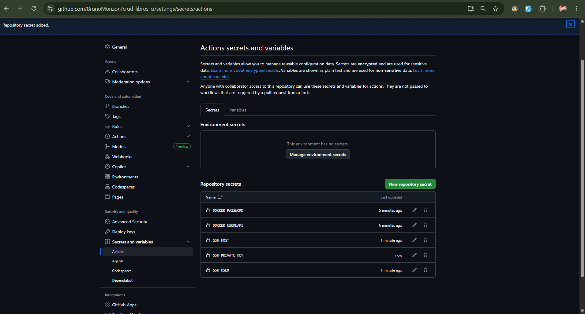

---

## 6. Evidencias del Pipeline

### 6.1 Build local de la imagen Docker

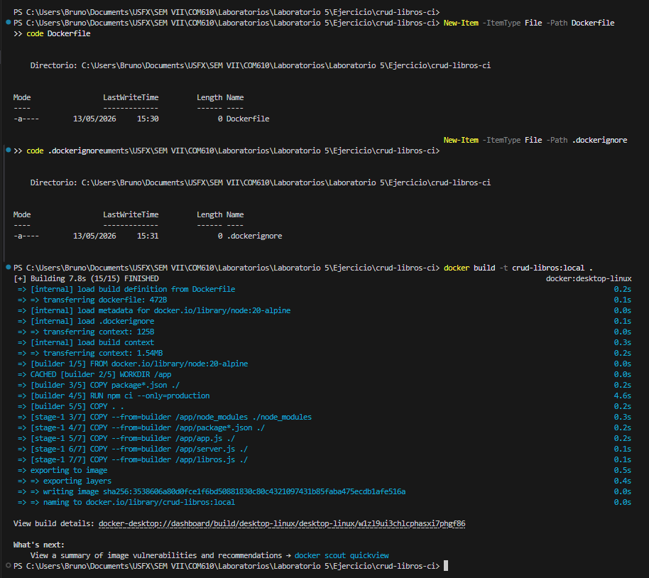

La imagen se construyó exitosamente en 7.8 segundos usando el build multi-stage.

### 6.2 Contenedor corriendo localmente

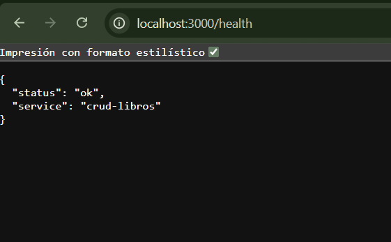

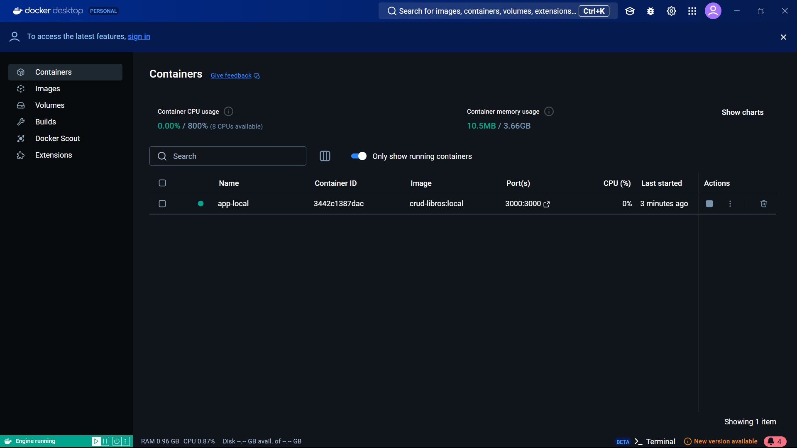

El endpoint `/health` respondió correctamente con `{"status":"ok","service":"crud-libros"}`.

### 6.3 Imagen publicada en Docker Hub

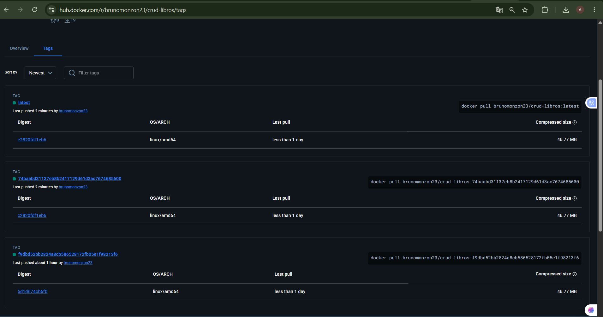

La imagen fue publicada con dos etiquetas: `:latest` y el SHA del commit.

### 6.4 Pipeline CD exitoso

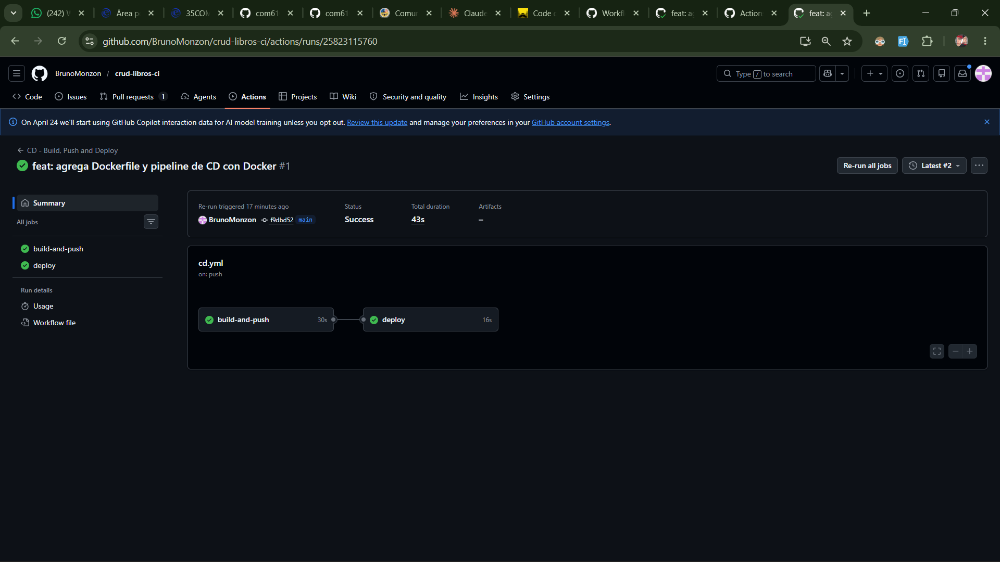

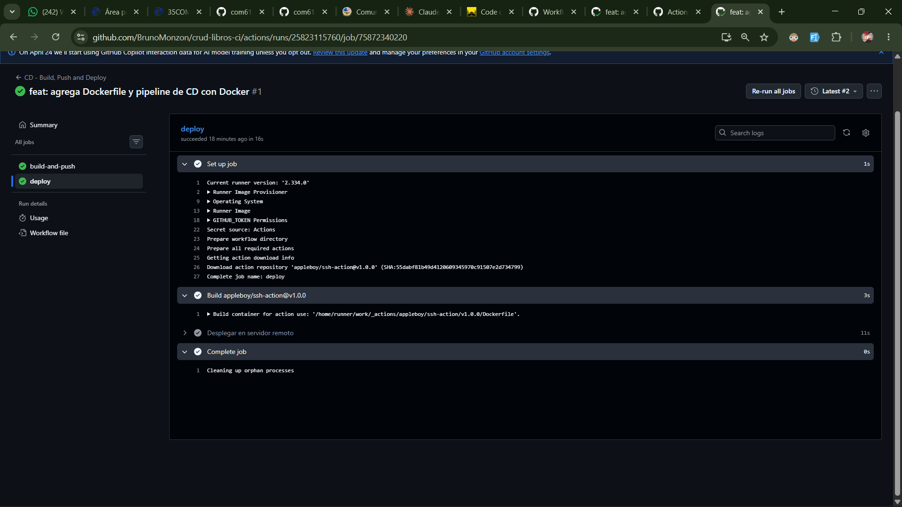

Los dos jobs corrieron secuencialmente:
1. ✅ `build-and-push` — construyó y subió la imagen a Docker Hub
2. ✅ `deploy` — se conectó por SSH a EC2 y desplegó el contenedor

### 6.5 API respondiendo desde EC2

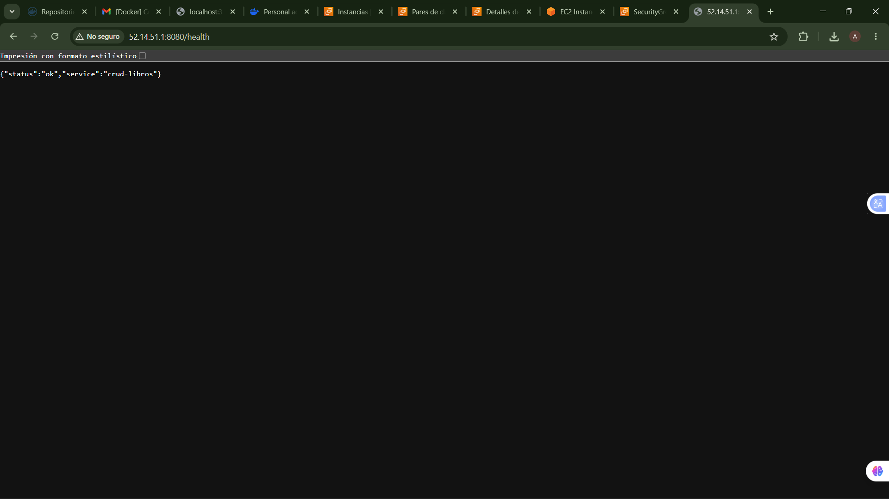

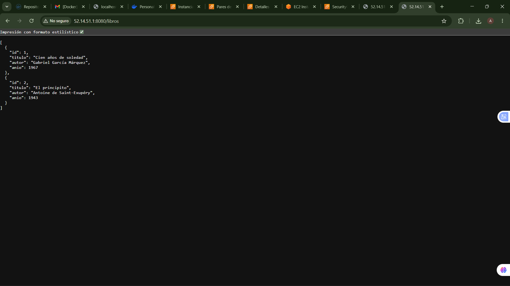

La API quedó accesible públicamente en `http://52.14.51.1:8080`.

### 6.6 Cambio desplegado automáticamente (v2.0.0)

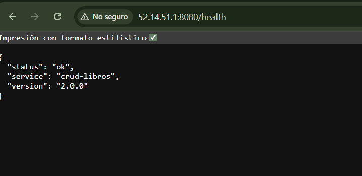

Se modificó el endpoint `/health` para retornar `version: '2.0.0'`. El pipeline se disparó automáticamente y el cambio quedó reflejado en EC2 sin intervención manual.

### 6.7 Pipeline fallido por health check

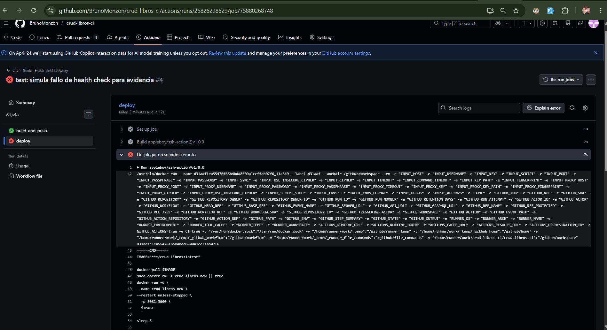

Se comentó el endpoint `/health` para simular un fallo. El job `deploy` falló ❌ porque el health check no recibió respuesta, manteniendo la versión anterior funcionando.

### 6.8 Pipeline recuperado

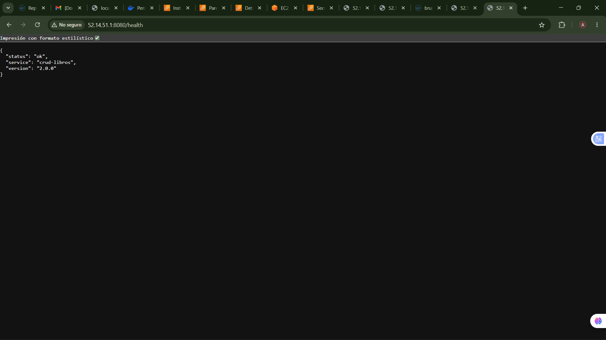

Se restauró el endpoint y el pipeline volvió a pasar ✅.

---

## 7. Procedimiento de Rollback

Si se necesita revertir a una versión anterior, se puede usar el SHA del commit con el que fue etiquetada la imagen:

```bash
# En el servidor EC2, reemplaza SHA_ANTERIOR por el SHA del commit
docker pull brunomonzon23/crud-libros:SHA_ANTERIOR
docker stop crud-libros
docker rm crud-libros
docker run -d \
  --name crud-libros \
  --restart unless-stopped \
  -p 8080:3000 \
  brunomonzon23/crud-libros:SHA_ANTERIOR
```

El SHA de cada commit se puede ver en la pestaña **Actions** de GitHub o en el historial de tags de Docker Hub.

---

## 8. Conclusiones

- El **Dockerfile multi-stage** es una buena práctica porque reduce el tamaño de la imagen final al no incluir herramientas de desarrollo innecesarias en producción.
- El **health check antes del deploy** es una medida de seguridad crítica — evita que una versión rota reemplace a una versión funcional, garantizando disponibilidad del servicio.
- El **etiquetado con SHA del commit** permite trazabilidad completa — siempre se sabe qué versión del código está corriendo en producción y se puede revertir rápidamente.
- La separación en **dos jobs secuenciales** (`build-and-push` → `deploy`) garantiza que el deploy solo ocurre si la imagen fue construida y publicada correctamente.
- Usar **secretos de GitHub** para credenciales sensibles (Docker Hub, SSH) es una práctica de seguridad fundamental que evita exponer datos sensibles en el código.
- En general, el pipeline de CD elimina el proceso manual de despliegue, reduciendo errores humanos y acelerando la entrega de nuevas versiones.

---

*Informe elaborado por Monzon Bruno Antonio — CU: 111-421 — COM610*
